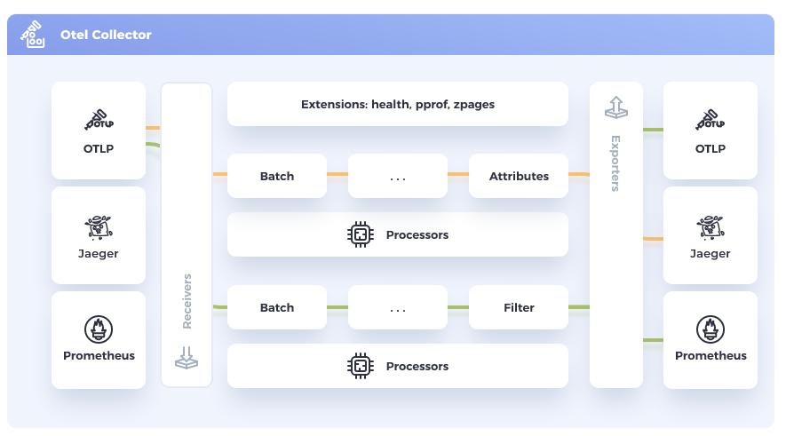

# OpenTelemetry Collector introduction

This tutorial step focuses on the [OpenTelemetry Collector](https://github.com/open-telemetry/opentelemetry-collector) introduction.

## Collector Overview

Structure of the OpenTelemetry Collector.
> Vendor-agnostic way to receive, process and export telemetry data.




The OpenTelemetry Collector can be devided into a few major components.

- **Receivers**: Collect data from a specific source, like an application or infrastructure, and convert it into [pData (pipeline data)](https://pkg.go.dev/go.opentelemetry.io/collector/consumer/pdata#section-documentation). This component can be active (e.g. Prometheus) or passive (OTLP).
- **Processors**: Manipulates the data collected by receivers in some way. For example, a processor might filter out irrelevant data, or add metadata to help with analysis. Like the batch or metric renaming processor.
- **Exporters**: Send data to an external system for storage or analysis. Examples are Prometheus, Loki or the OTLP exporter.
- **Extensions**: Add additional functionality to OpenTelemetry, like configuring a bearer token or offering a Jaeger remote sampling endpoint.
- **Connectors**: Is both an exporter and receiver. It consumes data as an exporter in one pipeline and emits data as a receiver in another pipeline.

For more details, check the [offical documentation](https://opentelemetry.io/docs/collector/).

### Collector Distributions

A set of receivers, processors, exporters, extensions and connectors is a distribution. Officially, there are two distributions provided with the names `core` and `contrib`. New releases are currently published every two weeks. After a release, the default collector distributions are available as binary, container image and linux distro packages.

- **core**: Components are developed and maintained by the OpenTelemetry core team. [[manifest-v0.75.0](https://github.com/open-telemetry/opentelemetry-collector-releases/blob/v0.75.0/distributions/otelcol/manifest.yaml)]
- **contrib**: Extends the core distribution with a large list of components developed by the OpenTelemetry Community components. [[manifest-v0.75.0](https://github.com/open-telemetry/opentelemetry-collector-releases/blob/v0.75.0/distributions/otelcol-contrib/manifest.yaml)]

### OpenTelemetry Collector Builder (OCB)

With each new release of the OpenTelemetry Collector distributions, a new version of the [OpenTelemetry Collector Builder](https://github.com/open-telemetry/opentelemetry-collector/blob/v0.75.0/cmd/builder) is released too.

```yaml
receivers:
  - gomod: go.opentelemetry.io/collector/receiver/otlpreceiver v0.75.0
  - gomod: github.com/open-telemetry/opentelemetry-collector-contrib/receiver/prometheusreceiver v0.75.0
  - gomod: github.com/open-telemetry/opentelemetry-collector-contrib/receiver/kafkareceiver v0.75.0
processors:
  - gomod: go.opentelemetry.io/collector/processor/batchprocessor v0.75.0
exporters:
  - gomod: go.opentelemetry.io/collector/exporter/otlpexporter v0.75.0
  - gomod: go.opentelemetry.io/collector/exporter/otlphttpexporter v0.75.0
  - gomod: github.com/open-telemetry/opentelemetry-collector-contrib/exporter/kafkaexporter v0.75.0
  - gomod: github.com/open-telemetry/opentelemetry-collector-contrib/exporter/prometheusremotewriteexporter v0.75.0
extensions:
  - gomod: github.com/open-telemetry/opentelemetry-collector-contrib/extension/oidcauthextension v0.75.0
connectors:
  - gomod: github.com/open-telemetry/opentelemetry-collector-contrib/connector/spanmetricsconnector v0.75.0
```

### Configuration

The configuration of the Open Telemetry Collector is described in yaml. The following shows an `OTLP/gRPC` receiver listening on `localhost:4317`. A batch processor with default parameters and a logging exporter with a normal log level. It also describes multiple pipelines for different telemetry data, which all route their collected telemetry data to the logging exporter.

The easiest way to learn more about the configuration options of individual components is to visit the readme in the component folder directly. Example [loggingexporter](https://github.com/open-telemetry/opentelemetry-collector/blob/v0.75.0/exporter/loggingexporter).

```yaml
receivers:
  otlp:
    protocols:
      grpc:
        endpoint: 127.0.0.1:4317
processors:
  batch:

exporters:
  logging:
    verbosity: normal

service:
  pipelines:
    metrics:
      receivers: [otlp]
      processors: [batch]
      exporters: [logging]
    logs:
      receivers: [otlp]
      processors: [batch]
      exporters: [logging]
    traces:
      receivers: [otlp]
      processors: [batch]
      exporters: [logging]
```

Get the config to start playing:
```bash
curl -LJO https://raw.githubusercontent.com/pavolloffay/kubecon-eu-2023-opentelemetry-kubernetes-tutorial/main/collector-config.yaml > collector-config.yaml
```

### Run collector locally

Here we launch a collector, which is accessible via localhost, with the previously downloaded `collector-config.yaml` description:
```bash
docker run --rm -it --name otel-collector -p 4317:4317 -p 4318:4318 -v ${PWD}/collector-config.yaml:/tmp/collector-config.yaml:z ghcr.io/open-telemetry/opentelemetry-collector-releases/opentelemetry-collector:0.74.0 --config /tmp/collector-config.yaml
```

### Send telemetry data to your Collector

The previously configured collector is now listening on `localhost:4317` **without** TLS. To test whether the collector actually receives metrics, logs, traces and passes them on to the specified logging exporter, we can generate test data with `telemetrygen`.

```bash
telemetrygen metrics --otlp-insecure --duration 10s --rate 4
# or
telemetrygen logs --otlp-insecure --duration 10s --rate 4
# or
telemetrygen traces --otlp-insecure --duration 10s --rate 4
```

If you do not have `telemetrygen` installed, alternatively you can use the container image instead:
```bash
docker run --rm -it --link otel-collector ghcr.io/open-telemetry/opentelemetry-collector-contrib/telemetrygen:v0.74.0 metrics --otlp-endpoint=otel-collector:4317 --otlp-insecure --duration 10s --rate 4
# or
docker run --rm -it --link otel-collector ghcr.io/open-telemetry/opentelemetry-collector-contrib/telemetrygen:v0.74.0 logs --otlp-endpoint=otel-collector:4317 --otlp-insecure --duration 10s --rate 4
# or
docker run --rm -it --link otel-collector ghcr.io/open-telemetry/opentelemetry-collector-contrib/telemetrygen:v0.74.0 traces --otlp-endpoint=otel-collector:4317 --otlp-insecure --duration 10s --rate 4
```

Expected output:

```bash
2023-04-22T12:27:26.638Z	info	LogsExporter	{"kind": "exporter", "data_type": "logs", "name": "logging", "#logs": 1}
2023-04-22T12:27:30.248Z	info	LogsExporter	{"kind": "exporter", "data_type": "logs", "name": "logging", "#logs": 2}
2023-04-22T12:27:34.457Z	info	MetricsExporter	{"kind": "exporter", "data_type": "metrics", "name": "logging", "#metrics": 2}
2023-04-22T12:27:34.857Z	info	MetricsExporter	{"kind": "exporter", "data_type": "metrics", "name": "logging", "#metrics": 1}
2023-04-22T12:27:39.468Z	info	TracesExporter	{"kind": "exporter", "data_type": "traces", "name": "logging", "#spans": 8}
2023-04-22T12:27:41.473Z	info	TracesExporter	{"kind": "exporter", "data_type": "traces", "name": "logging", "#spans": 10}
```

---
[Next steps](./02-operator-introduction.md)
