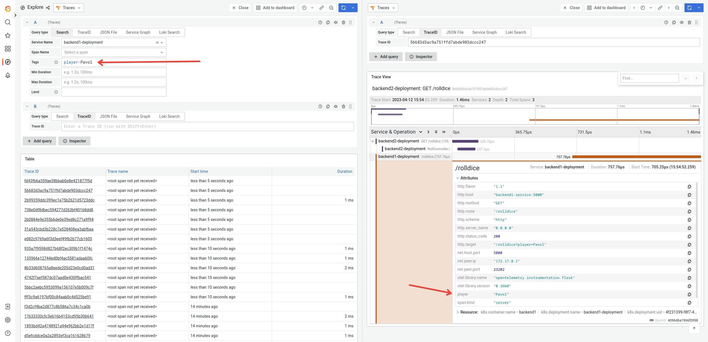

# Deploy & instrument the application

This tutorial step focuses on instrumenting the services of the
[sample application](./app).

## Application Description

The sample application is a simple _"dice game"_, where two players roll a
dice, and the player with the highest number wins.

There are 3 microservices within this application:

- Service `frontend` in Node.JS, that has an API endpoint `/` which takes two
  player names as query parameters (player1 and player2). The service calls 2
  down stream services (backend1, backend2), which each returning a random number
  between 1-6. The winner is computed and returned.
- Service `backend1` in python, that has an API endpoint `/rolldice` which takes
  a player name as query parameter. The service returns a random number between
  1 and 6.
- Service `backend2` in Java, that also has an API endpoint `/rolldice` which
  takes a player name as query parameter. The service returns a random number
  between 1 and 6.

Additionally there is a `lodagen` service, which utilizes `curl` to periodically
 call the frontend service.

 Let's assume player `alice` and `bob` use our service, here's a potential
 sequence diagram:


## Manual or Automatic Instrumentation?

To make your application emit traces, metrics & logs you can either instrument
your application _manually_ or _automatically_:

- Manual instrumentation means that you modify your code yourself: you initialize and
  configure the SDK, you load instrumentation libraries, you create your own spans,
  metrics, etc.
  Developers can use this approach to tune the observability of their application to
  their needs.
- Automatic instrumentation means that you don't have to touch your code to get your
  application emit code.
  Automatic instrumentation is great to get you started with OpenTelemetry, and it is
  also valuable for Application Operators, who have no access or insights about the
  source code.

In the following we will introduce you to both approaches.

## Manual instrumentation

As a developer you can add OpenTelemetry to your code by using the
language-specific SDKs.

Here you will only instrument the frontend service manually, we will use
automatic instrumentation for the other services in the next step.

Before starting, make sure that you have an OpenTelemetry collector up and running
locally, as described in the [OpenTelemetry Collector introduction](./01-collector-introduction.md)

For development you can run the app locally by installing all dependencies
and running it with `nodemon` from the [./app/frontend](./app/frontend/) directory:

```bash
cd app/frontend
npm install
npx nodemon index.js
```

If you don't have `Node.JS` installed locally, you can use a container for development:

```bash
cd app/frontend
docker run -p 4000:4000 --link otel-colector --rm -t -i -v ${PWD}:/app:z node:18-alpine /bin/sh
```

Within the container run:

```bash
cd /app
npm install
npx nodemon index.js
```

Open the [index.js](./app/frontend/index.js) file with your preferred editor.
Use the instructions provided by the
[official OpenTelemetry documentation](https://opentelemetry.io/docs/instrumentation/js/getting-started/nodejs/)
to add tracing & metrics. A few differences in your implementation:

- Instead of creating a dedicated `instrument.js` you can add the initialization of the SDK at the top of `index.js` directly.
- Replace the `ConsoleSpanExporter` with an `OTLPTraceExporter` as outlined in the [Exporters](https://opentelemetry.io/docs/instrumentation/js/exporters/) documentation (make use of `opentelemetry/exporter-metrics-otlp-grpc` & `opentelemetry/exporter-trace-otlp-grpc`)

Give it a try yourself, if you are unsure how to accomplish this, you can peek
into the [instrument.js](./app/frontend/instrument.js) file.

To see if spans are emitted to the collector, call the frontend service via your
browser or curl:

```bash
curl localhost:4000/
```

The **Internal Server Error** response is OK for now, because you don't have the backends
running.

If all works, your OpenTelemetry collector should receive metrics & traces and
the logs of the frontend service should contain `trace_id` and `span_id`

Finally, look into the `index.js` file once again, there are a few additional
`TODOs` for you!

## Deploy the application

Run the following command to deploy the sample application to your cluster:

```bash
kubectl apply -f https://raw.githubusercontent.com/pavolloffay/kubecon-eu-2023-opentelemetry-kubernetes-tutorial/main/app/k8s.yaml
```

After a short while, verify that it has been deployed successfully:

```bash
$ kubectl get all -n tutorial-application
NAME                                       READY   STATUS    RESTARTS   AGE
pod/loadgen-deployment-5cc46c7f8c-6wwrm    1/1     Running   0          39m
pod/backend1-deployment-69bf64db96-nhd98   1/1     Running   0          19m
pod/frontend-deployment-bdbff495f-wc48h    1/1     Running   0          19m
pod/backend2-deployment-856b75d696-d4m6d   1/1     Running   0          19m

NAME                       TYPE        CLUSTER-IP     EXTERNAL-IP   PORT(S)    AGE
service/backend1-service   ClusterIP   10.43.194.58   <none>        5000/TCP   39m
service/backend2-service   ClusterIP   10.43.176.21   <none>        5165/TCP   39m
service/frontend-service   ClusterIP   10.43.82.230   <none>        4000/TCP   39m

NAME                                  READY   UP-TO-DATE   AVAILABLE   AGE
deployment.apps/loadgen-deployment    1/1     1            1           39m
deployment.apps/backend1-deployment   1/1     1            1           39m
deployment.apps/frontend-deployment   1/1     1            1           39m
deployment.apps/backend2-deployment   1/1     1            1           39m
```

### Port forward

Now let's port forward the frontend application:

```bash
kubectl port-forward -n tutorial-application svc/frontend-service 4000:4000
```

Open it in the browser [localhost:4000](http://localhost:4000/)

## Auto-instrumentation

The OpenTelemetry Operator supports injecting and configuring
auto-instrumentation for you.

With the operator & collector running you can now let the Operator know,
what pods to instrument and which auto-instrumentation to use for those pods.
This is done via the `Instrumentation` CRD. A basic `Instrumentation` resource
looks like the following:

```yaml
apiVersion: opentelemetry.io/v1alpha1
kind: Instrumentation
metadata:
  name: my-instrumentation
  namespace: tutorial-application
spec:
  exporter:
    endpoint: http://otel-collector.observability-backend.svc.cluster.local:4317
```

To create an [Instrumentation resource](./app/instrumentation.yaml) for our sample application run the following
command:

```bash
kubectl apply -f https://raw.githubusercontent.com/pavolloffay/kubecon-eu-2023-opentelemetry-kubernetes-tutorial/main/app/instrumentation.yaml
```

Until now we only have created the `Instrumentation` resource, in a next step you
need to opt-in your services for auto-instrumentation. This is done by updating
your service's `spec.template.metadata.annotations`

### Configure Node.JS - frontend service

You have instrumented the frontend service manually in a previous step. In a real
world scenario you would now rebuild your container image, upload it into the registry
and make use of it in your deployment:

```yaml
    spec:
      containers:
      - name: frontend
        image: ghcr.io/pavolloffay/kubecon-eu-2023-opentelemetry-kubernetes-tutorial-frontend:latest
        env:
          - name: OTEL_INSTRUMENTATION_ENABLED
            value: "true"
```

To provide you with a shortcut here, we have prepared a way for you to use a _manually_
instrumented version of the frontend: The environment variable `OTEL_INSTRUMENTATION_ENABLED` set to true
will make sure that the [instrument.js](./app/frontend/instrument.js) is included.

The `Node.js` auto-instrumentation supports traces and metrics.

Before applying the annotation let's take a look at the pod specification:
```bash
kubectl get pods -n tutorial-application -l app=frontend -o yaml
```

All you need to do now, is to inject the configuration:

```bash
kubectl patch deployment frontend-deployment -n tutorial-application -p '{"spec": {"template":{"metadata":{"annotations":{"instrumentation.opentelemetry.io/inject-sdk":"true"}}}} }'
```

Now verify that it worked:

```bash
kubectl get pods -n tutorial-application -l app=frontend -o yaml
```

and [access traces](http://localhost:3000/grafana/explore?orgId=1&left=%7B%22datasource%22:%22tempo%22,%22queries%22:%5B%7B%22refId%22:%22A%22,%22datasource%22:%7B%22type%22:%22tempo%22,%22uid%22:%22tempo%22%7D,%22queryType%22:%22nativeSearch%22,%22serviceName%22:%22frontend-deployment%22%7D%5D,%22range%22:%7B%22from%22:%22now-1h%22,%22to%22:%22now%22%7D%7D).

### Instrument Python - backend1 service

The `Python` auto-instrumentation supports traces and metrics.

Before applying the annotation let's take a look at the pod specification:
```bash
kubectl get pods -n tutorial-application -l app=backend1 -o yaml
```

Let's enable in instrumentation by applying the annotation:

```bash
kubectl patch deployment backend1-deployment -n tutorial-application -p '{"spec": {"template":{"metadata":{"annotations":{"instrumentation.opentelemetry.io/inject-python":"true"}}}} }'
```

Now verify the instrumentation:

```bash
kubectl get pods -n tutorial-application -l app=backend1 -o yaml
```

and [access traces](http://localhost:3000/grafana/explore?orgId=1&left=%7B%22datasource%22:%22tempo%22,%22queries%22:%5B%7B%22refId%22:%22A%22,%22datasource%22:%7B%22type%22:%22tempo%22,%22uid%22:%22tempo%22%7D,%22queryType%22:%22nativeSearch%22,%22serviceName%22:%22backend1-deployment%22,%22spanName%22:%22%2Frolldice%22%7D,%7B%22refId%22:%22B%22,%22datasource%22:%7B%22type%22:%22tempo%22,%22uid%22:%22tempo%22%7D,%22queryType%22:%22traceId%22%7D%5D,%22range%22:%7B%22from%22:%22now-1h%22,%22to%22:%22now%22%7D%7D).

### Instrument Java - backend2 service

The `Java` auto-instrumentation supports traces, metrics and logs.

Before applying the annotation let's take a look at the pod specification:
```bash
kubectl get pods -n tutorial-application -l app=backend2 -o yaml
```

Let's enable in instrumentation by applying the annotation:

```bash
kubectl patch deployment backend2-deployment -n tutorial-application -p '{"spec": {"template":{"metadata":{"annotations":{"instrumentation.opentelemetry.io/inject-java":"true"}}}} }'
```

Now verify the instrumentation:

```bash
kubectl get pods -n tutorial-application -l app=backend2 -o yaml
```

and [access traces](http://localhost:3000/grafana/explore?orgId=1&left=%7B%22datasource%22:%22tempo%22,%22queries%22:%5B%7B%22refId%22:%22A%22,%22datasource%22:%7B%22type%22:%22tempo%22,%22uid%22:%22tempo%22%7D,%22queryType%22:%22nativeSearch%22,%22serviceName%22:%22backend2-deployment%22%7D,%7B%22refId%22:%22B%22,%22datasource%22:%7B%22type%22:%22tempo%22,%22uid%22:%22tempo%22%7D,%22queryType%22:%22traceId%22%7D%5D,%22range%22:%7B%22from%22:%22now-1h%22,%22to%22:%22now%22%7D%7D).

### The full picture

How everything should look like after running through the previous steps:


Wait for a little bit and then [access your traces once again](http://localhost:3000/grafana/explore?orgId=1&left=%7B%22datasource%22:%22tempo%22,%22queries%22:%5B%7B%22refId%22:%22A%22,%22datasource%22:%7B%22type%22:%22tempo%22,%22uid%22:%22tempo%22%7D,%22queryType%22:%22nativeSearch%22,%22serviceName%22:%22frontend-deployment%22%7D%5D,%22range%22:%7B%22from%22:%22now-1h%22,%22to%22:%22now%22%7D%7D). You should see traces starting in the frontend and continuing across the backend services.


## Resource attributes

There are several ways how essential Kubernetes resource attributes (`Namespace`, `Deployment`, `ReplicaSet`, `Pod` name and UIDs) can be collected:

* The `Instrumentation` CR - operator injects the attributes to the application container via `OTEL_RESOURCE_ATTRIBUTES` env var. The OpenTelemetry SDK used in the auto-instrumentation reads the variable.
* The `OpenTelemetryCollector` CR - the [k8sattributesprocessor](https://github.com/open-telemetry/opentelemetry-collector-contrib/tree/main/processor/k8sattributesprocessor) enriches spans with attributes in the collector
* The `OpenTelemetryCollector` CR - in the `sidecar` mode use [resourcedetectionprocessor](https://github.com/open-telemetry/opentelemetry-collector-contrib/tree/main/processor/resourcedetectionprocessor). The operator sets `OTEL_RESOURCE_ATTRIBUTES` with Kubernetes resource attributes and the variable can be consumed by `env` detector see [the blog post](https://opentelemetry.io/blog/2022/k8s-metadata/#using-resource-detector-processor) for more details.

Kubernetes resource attributes like  are set 

```yaml
apiVersion: v1
kind: Pod
metadata:
  annotations:
    instrumentation.opentelemetry.io/inject-java: "true"
  name: backend2-deployment-58cfcb8db7-tdc8v
  namespace: tutorial-application
spec:
  containers:
  - env:
    - name: JAVA_TOOL_OPTIONS
      value: ' -javaagent:/otel-auto-instrumentation/javaagent.jar'
    - name: OTEL_SERVICE_NAME
      value: backend2-deployment
    - name: OTEL_EXPORTER_OTLP_ENDPOINT
      value: http://otel-collector.observability-backend.svc.cluster.local:4317
    - name: OTEL_RESOURCE_ATTRIBUTES_POD_NAME
      valueFrom:
        fieldRef:
          apiVersion: v1
          fieldPath: metadata.name
    - name: OTEL_RESOURCE_ATTRIBUTES_NODE_NAME
      valueFrom:
        fieldRef:
          apiVersion: v1
          fieldPath: spec.nodeName
    - name: OTEL_PROPAGATORS
      value: tracecontext,baggage,b3
    - name: OTEL_TRACES_SAMPLER
      value: parentbased_traceidratio
    - name: OTEL_TRACES_SAMPLER_ARG
      value: "1"
    - name: OTEL_RESOURCE_ATTRIBUTES
      value: k8s.container.name=backend2,k8s.deployment.name=backend2-deployment,k8s.namespace.name=tutorial-application,k8s.node.name=$(OTEL_RESOURCE_ATTRIBUTES_NODE_NAME),k8s.pod.name=$(OTEL_RESOURCE_ATTRIBUTES_POD_NAME),k8s.replicaset.name=backend2-deployment-58cfcb8db7
```

Let's enable collection of Kubernetes UID attributes. Update the `Instrumentation` CR:

```bash
kubectl edit instrumentations.opentelemetry.io my-instrumentation -n tutorial-application 
```

```yaml
spec:
  resource:
    addK8sUIDAttributes: true
```

The resource attributes are injected to the application container, to apply the change on already running applications a restart is required:

```bash
kubectl rollout restart deployment -n tutorial-application -l app=backend1
kubectl rollout restart deployment -n tutorial-application -l app=backend2
kubectl rollout restart deployment -n tutorial-application -l app=frontend
```

[Traces in Grafana](http://localhost:3000/grafana/explore?orgId=1&left=%7B%22datasource%22:%22tempo%22,%22queries%22:%5B%7B%22refId%22:%22A%22,%22datasource%22:%7B%22type%22:%22tempo%22,%22uid%22:%22tempo%22%7D,%22queryType%22:%22nativeSearch%22,%22serviceName%22:%22frontend-deployment%22%7D%5D,%22range%22:%7B%22from%22:%22now-1h%22,%22to%22:%22now%22%7D%7D).


## Sampling

Sampling in OpenTelemetry SDK and auto-instrumentations is configured via `OTEL_TRACES_SAMPLER` and `OTEL_TRACES_SAMPLER_ARG` environment variables.
In our demo these environment variables are configured in the `Instrumentation` CR.

Let's change the sampling rate (argument) to sample 25% of requests:

```bash
kubectl edit instrumentations.opentelemetry.io my-instrumentation -n tutorial-application
```

```yaml
spec:
  sampler:
    type: parentbased_traceidratio
    argument: "0.25"
```

Restart of applications is required again, the OTEL environment variables are set only at the pod startup:

```bash
kubectl rollout restart deployment -n tutorial-application -l app=backend1
kubectl rollout restart deployment -n tutorial-application -l app=backend2
kubectl rollout restart deployment -n tutorial-application -l app=frontend
```

Now let's take a look at the Grafana dashboard of the collector for [received traces](http://localhost:3000/grafana/d/7hHiATL4z/collector?orgId=1&viewPanel=7).

All possible values of `type` and `argument` are defined in [SDK configuration](https://github.com/open-telemetry/opentelemetry-specification/blob/main/specification/sdk-environment-variables.md#general-sdk-configuration)

### Remotely configurable sampling

Jaeger remote sampler allows dynamically configure OpenTelemetry SDKs. 
The collector can be configured with Jaeger remote sampler extension that exposes
an endpoint for SDKs to retrieve sampling configuration per service and span operation name.

* [Jaeger remote sampler spec](https://github.com/open-telemetry/opentelemetry-specification/blob/main/specification/trace/sdk.md#jaegerremotesampler)
* [SDK sampler configuration](https://github.com/open-telemetry/opentelemetry-specification/blob/main/specification/sdk-environment-variables.md#general-sdk-configuration)
* [Collector Jaeger remote sampler extension](https://github.com/open-telemetry/opentelemetry-collector-contrib/tree/main/extension/jaegerremotesampling)

## PII and data manipulation

The collector can add, change and/or remove data that is flowing through it (spans, attributes etc.). This is useful to extract new attributes that can be later used for querying. Second use-case for data manipulation is to handle personally identifiable information (PII).

The following collector processors can be used for data manipulation:

* [attributesprocessor](https://github.com/open-telemetry/opentelemetry-collector-contrib/tree/main/processor/attributesprocessor) removes attributes. 
* [filterprocessor](https://github.com/open-telemetry/opentelemetry-collector-contrib/tree/main/processor/filterprocessor) removes spans and attributes. It supports regex.
* [redactionprocessor](https://github.com/open-telemetry/opentelemetry-collector-contrib/tree/main/processor/redactionprocessor) deletes span attributes that don't match a list of allowed span attributes.
* [transformprocessor](https://github.com/open-telemetry/opentelemetry-collector-contrib/tree/main/processor/transformprocessor) modifies telemetry based on configuration using the [OpenTelemetry Transformation Language](https://github.com/open-telemetry/opentelemetry-collector-contrib/tree/main/pkg/ottl).

Now let's edit the collector configuration to extract player's name from `http.target` attribute:

```bash
kubectl edit opentelemetrycollectors.opentelemetry.io otel -n observability-backend 
```

```yaml
  processors:
    attributes:
      actions:
      - key: "http.target"
        pattern: ^.*\?player=(?P<player>.*)
        action: extract
          
    service:
      pipelines:
        traces:
          processors: [memory_limiter, attributes, batch]
```

See [traces in Grafana](http://localhost:3000/grafana/explore?orgId=1&left=%7B%22datasource%22:%22tempo%22,%22queries%22:%5B%7B%22refId%22:%22A%22,%22datasource%22:%7B%22type%22:%22tempo%22,%22uid%22:%22tempo%22%7D,%22queryType%22:%22nativeSearch%22,%22search%22:%22player%3DPavol%22%7D,%7B%22refId%22:%22B%22,%22datasource%22:%7B%22type%22:%22tempo%22,%22uid%22:%22tempo%22%7D,%22queryType%22:%22traceId%22%7D%5D,%22range%22:%7B%22from%22:%22now-3h%22,%22to%22:%22now%22%7D%7D&right=%7B%22datasource%22:%22tempo%22,%22queries%22:%5B%7B%22query%22:%2256683d3ac9a751ffd7abde903dccc247%22,%22queryType%22:%22traceId%22,%22refId%22:%22A%22%7D%5D,%22range%22:%7B%22from%22:%221681295096718%22,%22to%22:%221681309496718%22%7D%7D)



---
[Next Steps](./04-metrics.md)
