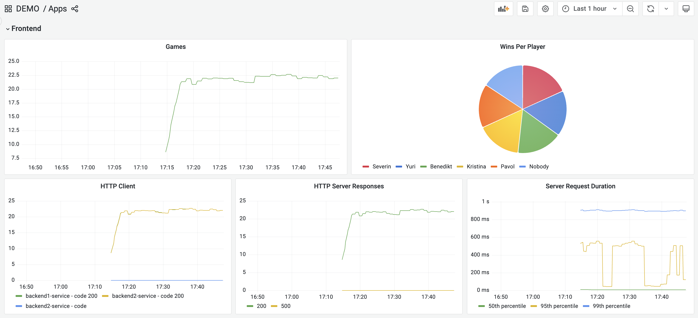
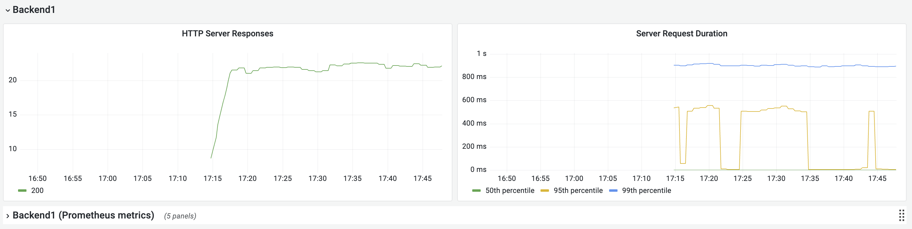
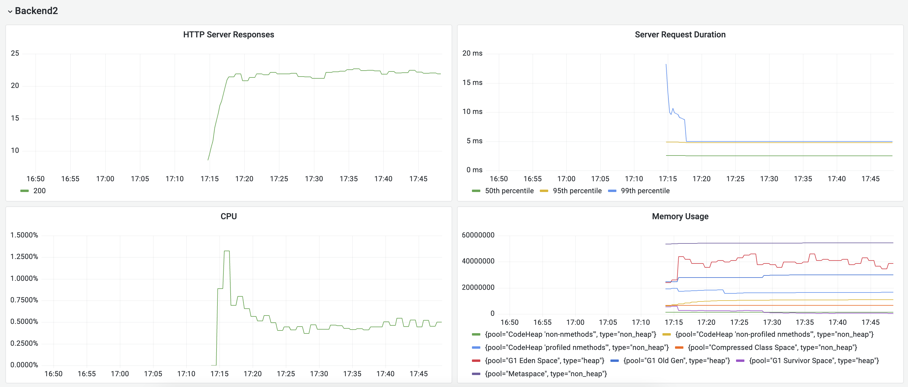
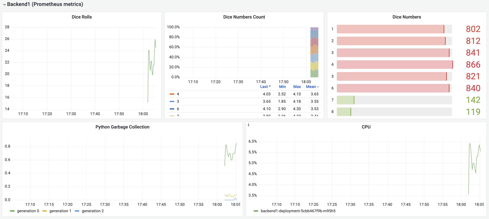
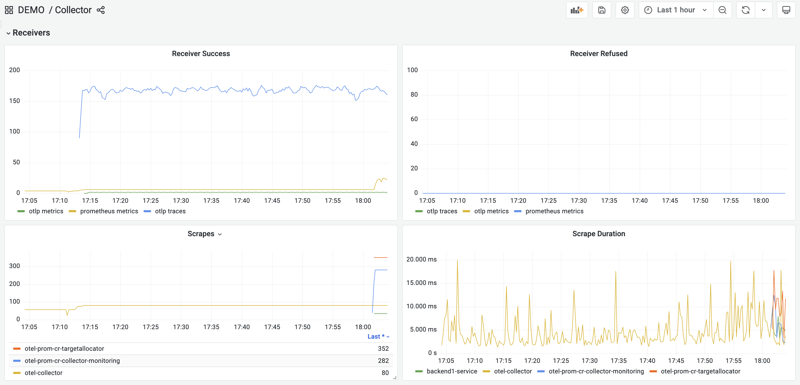
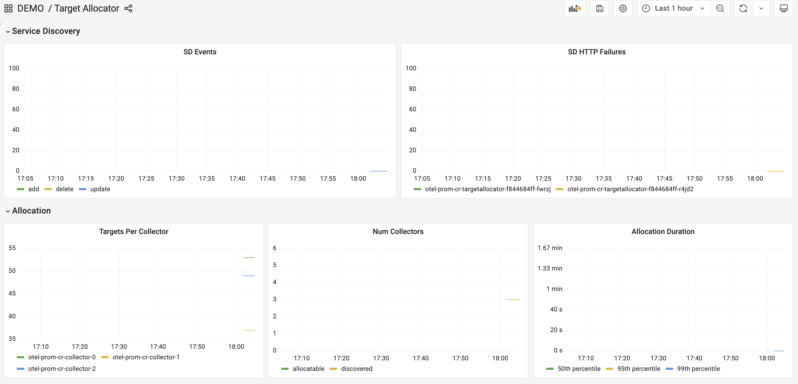
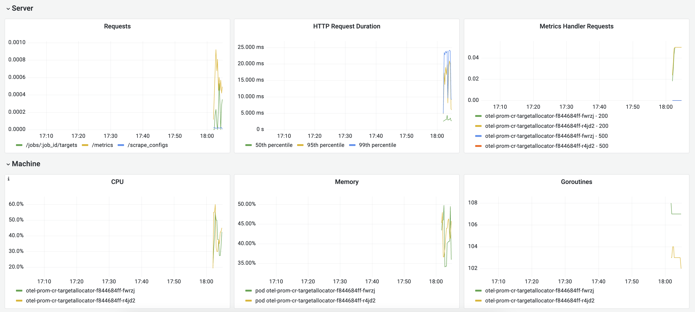
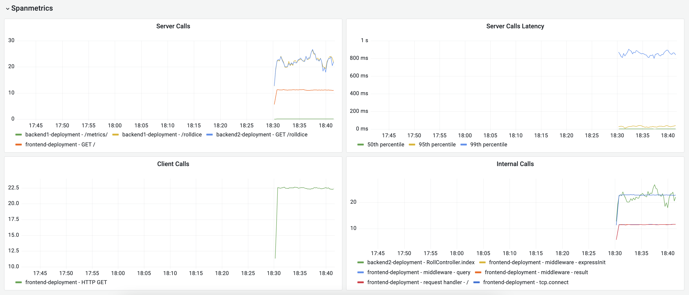

# Metrics

This tutorial step focuses on metrics, how the collector can help in metric scraping, and how to use the collector 
to create metrics from spans.

## Auto-instrumentation and metrics

Our instrumentation we set up in the previous step provides metrics as well, which we can see in the
[Apps Dashboard](http://localhost:3000/grafana/d/WbvDPqY4k/apps?orgId=1):




Our backend1 app has additional prometheus metrics that were previously instrumented.  We want to be able to see them 
as well, which we can enable in the following steps.

## Prometheus Target Discovery

#### Service and Pod Monitors

If you have services already generating metrics for prometheus, the collector can collect those using the prometheus 
receiver, which scrapes metric endpoints provided in a scrape_config like the one below:
```yaml
    - job_name: 'otel-collector'
      scrape_interval: 10s
      static_configs:
        - targets: [ '0.0.0.0:8888' ]
```

This solution works but requires writing out all known targets.  When services being deployed are added or changed, 
it will require updating this configuration.  An alternative to this is to set up Prometheus [Service and Pod Monitors](https://github.com/prometheus-operator/prometheus-operator/blob/main/Documentation/design.md#servicemonitor).
This allows for discovering metric endpoint dynamically and without needing to modify the collector configuration and 
restart all collectors.

In order to apply a pod or service monitor, the CRDs need to be installed:
```shell
kubectl apply -f https://raw.githubusercontent.com/prometheus-operator/prometheus-operator/main/example/prometheus-operator-crd/monitoring.coreos.com_servicemonitors.yaml

kubectl apply -f https://raw.githubusercontent.com/prometheus-operator/prometheus-operator/main/example/prometheus-operator-crd/monitoring.coreos.com_podmonitors.yaml
```

You can verify both CRDs are present with the command `kubectl get customresourcedefinitions`, and then the below lines 
should be included in your list of CRDs (dates will differ):
```shell
podmonitors.monitoring.coreos.com          2023-04-11T22:17:04Z
servicemonitors.monitoring.coreos.com      2023-04-11T22:16:58Z
```

### Target Allocator

A service called the [Target Allocator](https://github.com/open-telemetry/opentelemetry-operator/blob/main/cmd/otel-allocator/README.md)
can use the prometheus service and pod monitor to discover targets. The target allocator discovers the targets and then 
distributes both discovered and configured targets among available collectors. It must be deployed alongside a 
Statefulset of collectors.

Applying this chart will start a new collector as a StatefulSet with the target allocator enabled:
```shell
kubectl apply -f https://raw.githubusercontent.com/pavolloffay/kubecon-eu-2023-opentelemetry-kubernetes-tutorial/main/backend/03-collector-prom-cr.yaml
```

Applying this chart will set up service monitors for the backend1 service, the target allocators, and the collector statefulset:
```shell
kubectl apply -f https://raw.githubusercontent.com/pavolloffay/kubecon-eu-2023-opentelemetry-kubernetes-tutorial/main/backend/04-servicemonitors.yaml
```

You can verify the collectors and target allocators have been deployed with the command `kubectl get pods -n observability-backend`, where we should see five additional pods:
```shell
otel-prom-cr-collector-0                       1/1     Running   2 (18m ago)   18m
otel-prom-cr-collector-1                       1/1     Running   2 (18m ago)   18m
otel-prom-cr-collector-2                       1/1     Running   2 (18m ago)   18m
otel-prom-cr-targetallocator-f844684ff-fwrzj   1/1     Running   0             18m
otel-prom-cr-targetallocator-f844684ff-r4jd2   1/1     Running   0             18m
```

The service monitors can also be verified with `kubectl get servicemonitors -A`:
```shell
NAMESPACE               NAME                                AGE
observability-backend   otel-prom-cr-collector-monitoring   21m
observability-backend   otel-prom-cr-targetallocator        21m
tutorial-application    backend1-service                    21m
```

Now we're getting our backend1 prometheus metrics in the [Apps Dashboard](http://localhost:3000/grafana/d/WbvDPqY4k/apps?orgId=1):


We can see the bump in the prometheus metrics receiver and additional prometheus jobs in the [Collector Dashboard](http://localhost:3000/grafana/d/7hHiATL4z/collector?orgId=1):


And the Target Allocator has its own metrics in the [Target Allocator Dashboard](http://localhost:3000/grafana/d/ulLjw3L4z/target-allocator?orgId=1):



## Span metrics

In addition to acquiring instrumented metrics, we can use the [spanmetrics connector](https://github.com/open-telemetry/opentelemetry-collector-contrib/blob/main/connector/spanmetricsconnector/README.md)
to transform spans into Request, Error, and Duration (RED) metrics.  A [connector](https://github.com/open-telemetry/opentelemetry-collector/blob/main/connector/README.md#connectors)
is a special component in the collector that can consume data as an exporter in one pipeline and emit data as a 
receiver in another.

Our otel collector from the [Operator Introduction](./02-operator-introduction.md) is the collector receiving 
traces, so we want to modify its configuration to add the spanmetrics connector:
```shell
kubectl edit opentelemetrycollectors.opentelemetry.io otel -n observability-backend 
```
```shell
    connectors:
      spanmetrics:
        namespace: "converted"
        
    service:
      pipelines:
        traces:
          exporters: [otlp, spanmetrics]
        metrics:
          receivers: [prometheus, otlp, spanmetrics]
```

Then the collector will need to be restarted:
```shell
kubectl rollout restart deployment otel-collector -n observability-backend
```

Now we can see RED metrics at the bottom of the [Collector Dashboard](http://localhost:3000/grafana/d/7hHiATL4z/collector?orgId=1):


---
[Next Steps](./05-logs.md)
