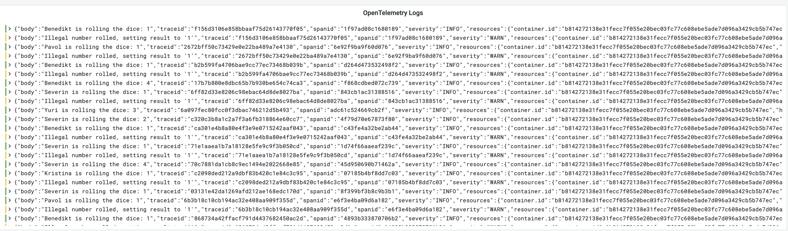

# Logs
This tutorial step focuses on logs, how the collector work on logs scraping and how to use the filelog receiver to transmit those logs to Loki.
## Summary

As far logs are concerned, one of the many challenges of SRE's is standardize the how the logs flow from diverse applications to different logging solutions, due to that, OpenTelemetry has the ability to receive and transmit logs through the OTLP protocol and create a correlation (e.g. through origin of the telemetry, execution context, time of execution, spanid) with metrics and traces.

## FileLog receiver
[Filelog](https://github.com/open-telemetry/opentelemetry-collector-contrib/tree/main/receiver/filelogreceiver) receiver is one of the various Receivers available on [OpenTelemetry Collector Contrib](https://github.com/open-telemetry/opentelemetry-collector-contrib).

## Filelog workflow. 


In order to demonstrate the logs instrumentation, we have to get the OpenTelemetry Instance running as a Daemonset:
````yaml
  filelog:
    include:
      - /var/log/pods/*/*/*.log
    #Each operator fulfills a single responsibility, 
    #such as reading lines from a file, or parsing JSON 
    #from a field. Operators are then chained together
    #in a pipeline to achieve a desired result.
    operators:
      # Parse CRI-O format
      - type: regex_parser
        id: parser-crio
        regex: '^(?P<time>[^ Z]+) (?P<stream>stdout|stderr) (?P<logtag>[^ ]*) ?(?P<log>.*)$'
        output: extract_metadata_from_filepath
        timestamp:
          parse_from: attributes.time
          layout_type: gotime
          layout: '2006-01-02T15:04:05.999999999Z07:00'
````

## OpenTelemetry Collector running as DaemonSet

As soon as you apply the following manifest, you will create an instance will receive the logs from the tutorial-application:

```shell
kubectl apply -f https://raw.githubusercontent.com/pavolloffay/kubecon-eu-2023-opentelemetry-kubernetes-tutorial/main/backend/05-collector-daemonset.yaml
```

You should be able to see a new collector instance running as Daemonset with the command following commands `kubectl get pods -n observability-backend`, `kubectl get daemonset -n observability-backend` where we should see 1 additional pod:
````shell
NAME                       DESIRED   CURRENT   READY   UP-TO-DATE   AVAILABLE   NODE SELECTOR   AGE
otel-daemonset-collector   1         1         1       1            1           <none>          2m
`````

````shell
NAME                              READY   STATUS    RESTARTS   AGE
grafana-576c6bc6f7-lqk5q          1/1     Running   0          32m
loki-0                            1/1     Running   0          32m
mimir-0                           1/1     Running   0          32m
otel-collector-6c4857cf66-mlcq6   1/1     Running   0          4m54s
otel-daemonset-collector-jgmw9    1/1     Running   0          10s
tempo-779c47bc56-ndws2            1/1     Running   0          32m
````

At this step we are creating a new instance pointing to the collector running as daemonset.
```shell
kubectl apply -f https://raw.githubusercontent.com/pavolloffay/kubecon-eu-2023-opentelemetry-kubernetes-tutorial/main/app/instrumentation-logs.yaml
```

You should be able to see a new instance running through the command `kubectl get otelinst -n tutorial-application`:
````shell
NAME                   AGE     ENDPOINT                                                                       SAMPLER                    SAMPLER ARG
instrumentation-logs   8m33s   http://otel-daemonset-collector.observability-backend.svc.cluster.local:4317   parentbased_traceidratio   1
````
Wait for a little bit and then [access your logs once again](http://localhost:3000/grafana/d/WfV_7jY4k/loki-dashboard?orgId=1). You should see logs starting in the frontend and continuing across the backend services.



---
[Next steps](./06-roadmap.md)
