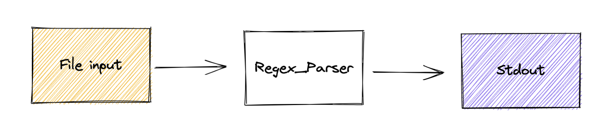

# Logs

## Summary

As far logs are concerned, one of the many challenges of SRE's is standardize the how the logs flow from diverse applications to different logging solutions, due to that, OpenTelemetry has the ability to receive and transmit logs through the OTLP protocol and create a correlation (e.g. through origin of the telemetry, execution context, time of execution, spanid) with metrics and traces.

## FileLog receiver
[Filelog](https://github.com/open-telemetry/opentelemetry-collector-contrib/tree/main/receiver/filelogreceiver) receiver is one of the various Receivers available on [OpenTelemetry Collector Contrib](https://github.com/open-telemetry/opentelemetry-collector-contrib).

## Filelog workflow. 


In order to demonstrate the logs instrumentation, we have to get the OpenTelemetry Instance running as a Daemonset:
````yaml
  filelog:
    include:
      - /var/log/pods/*/*/*.log
    #Each operator fulfills a single responsibility, 
    #such as reading lines from a file, or parsing JSON 
    #from a field. Operators are then chained together
    #in a pipeline to achieve a desired result.
    operators:
      # Parse CRI-O format
      - type: regex_parser
        id: parser-crio
        regex: '^(?P<time>[^ Z]+) (?P<stream>stdout|stderr) (?P<logtag>[^ ]*) ?(?P<log>.*)$'
        output: extract_metadata_from_filepath
        timestamp:
          parse_from: attributes.time
          layout_type: gotime
          layout: '2006-01-02T15:04:05.999999999Z07:00'
````

## OpenTelemetry Collector running as DaemonSet

```shell
kubectl apply -f https://raw.githubusercontent.com/pavolloffay/kubecon-eu-2023-opentelemetry-kubernetes-tutorial/main/backend/05-collector-daemonset.yaml
```
---
[Next steps](./06-roadmap.md)
