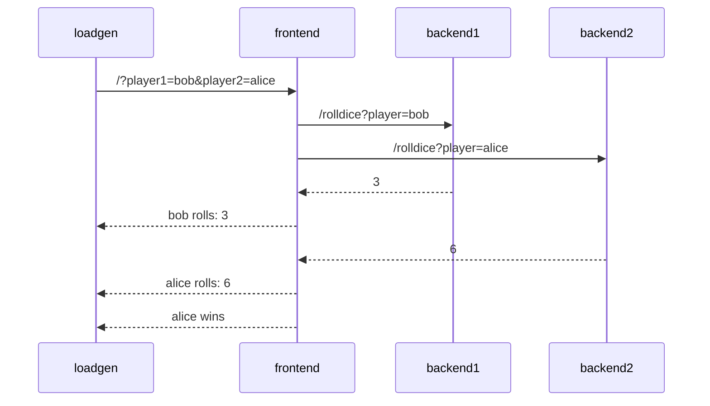

# Sample Application

## Description

The sample application is a simple _"dice game"_, where two players roll a
dice, and the player with the highest number wins.

There are 3 microservices within this application:

- Service `frontend` in Node.JS, that has an API endpoint `/` which takes two
  player names as query parameters (player1 and player2). The service calls 2
  down stream services (backend1, backend2), which each returning a random number
  between 1-6. The winner is computed and returned.
- Service `backend1` in python, that has an API endpoint `/rolldice` which takes
  a player name as query parameter. The service returns a random number between
  1 and 6.
- Service `backend2` in Java, that also has an API endpoint `/rolldice` which
  takes a player name as query parameter. The service returns a random number
  between 1 and 6.

Additionally there is a `lodagen` service, which utilizes `curl` to periodically
 call the frontend service.

 Let's assume player `alice` and `bob` use our service, here's a potential
 sequence diagram:



## Usage

### Docker Compose

The quickest way to try out the sample application is by using docker compose.
In the [app/](.) folder run:

```console
docker compose up
```

This will build the images for all services + the load generator and then run
them for you. You can test the frontend service yourself by calling it with
your browser or curl at <http://localhost:4000?player1=alice&player2=bob>

If you'd like to try out all services being instrumented with OpenTelemetry run

```console
docker compose --env-file=./otel-env up
```

### Kubernetes

To run the the sample application on your kubernetes cluster, run

```console
kubectl apply -f ./k8s.yaml
```

Note that this will pull images of the applications from ghcr.io.

If you'd like to access the frontend service, open a new terminal and run

```console
kubectl port-forward svc/frontend-service 4000:4000
```

### Development

If you'd like to change the code of any of the applications,
you need to install Node.JS, Java and python3 with flask first.

Then you can run them all standalone:

- frontend (in folder [./frontend](./frontend)):
  
  ```console
  node index.js
  ```

- backend1 (in folder [./backend1](./backend1)):

  ```console
  flask run
  ```

- backend2 (in folder [./backend2](./backend)):

  ```console
  dotnet watch
  ```
