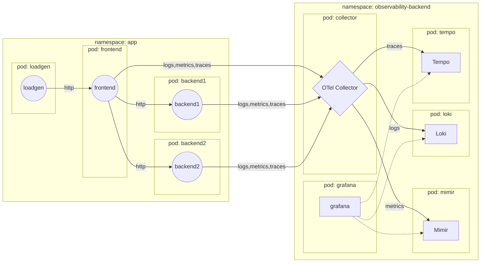

# Overview

How everything should look like after running through the tutorial:

```mermaid

flowchart LR
    subgraph namespace: observability-backend
        subgraph pod: collector
            OC{OTel Collector}
        end
        subgraph pod: mimir
            OC --metrics-->Mimir
        end
        subgraph pod: loki
            OC --logs-->Loki
        end
        subgraph pod: tempo
            OC --traces-->Tempo
        end
        subgraph pod: grafana
            grafana-.->Mimir
            grafana-.->Loki
            grafana-.->Tempo
        end
    end
    subgraph namespace: app
        subgraph pod: loadgen
            LG((loadgen))
        end
        subgraph pod: frontend
            LG --http--> F((frontend)) --logs,metrics,traces--> OC
        end
        subgraph pod: backend1
            F --http--> B1((backend1)) --logs,metrics,traces--> OC
        end
        subgraph pod: backend2
            F --http--> B2((backend2)) --logs,metrics,traces--> OC
        end
    end
```
